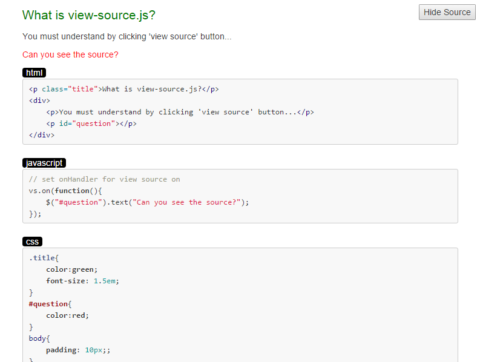

# view-source.js

view-source.js can add  "view source" button automatically to your website, showing highlighted source of html,js,css  

##Installation

    bower install view-source

##Requires    
   
JQuery    
    
##Usage

**Just add one line** to head section in html,  
to load view-source.js from your bower modules, like this:  
(! You must load JQuery ahead !)

    
    
and add 'vs' class to the source code you want to show, like this:  

####html

    

        
This is html source to show.

    

    
####css

    
    
####javascript

    

##Example

Please git clone this repository, and open /text/index.html by browser.
    
    

